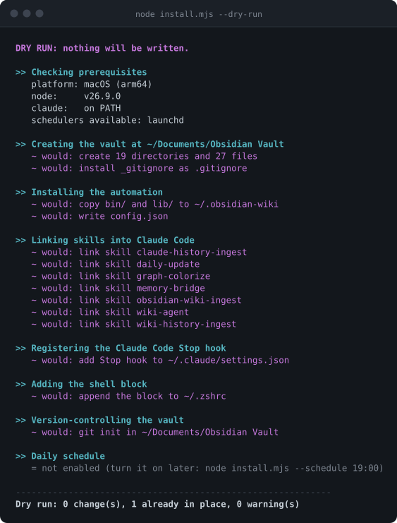

<div align="center">


# Obsidian Vault Kit

**A knowledge vault Claude Code maintains for you.** Feed it documents and it writes linked,
filed notes. Use Claude Code normally and it mines your own sessions for whatever was worth
keeping.

[](https://github.com/mustafa4101996ahmed/obsidian-vault-kit/actions/workflows/ci.yml)


</div>

<p align="center">
  
</p>

---

> [!IMPORTANT]
> **A run that recorded nothing ingested nothing.** The runner checks whether
> `.manifest.json` moved and treats an untouched ledger as a failure regardless of the exit
> code. A pipeline that reports success while doing no work is the failure that hides
> longest.

## How it works

You drop a document in, or you simply use Claude Code. Either way the vault fills up.

```
  a document you drop in --+
                          +--> Claude reads it, decides which zone each
  your Claude Code   -----+    piece belongs in, writes linked notes
  sessions and memory          and records the source in the ledger
                                             |
                                             v
                               a graph you can query, instead of
                               a folder you never open again
```

Nine folders sort notes by **shape**, not subject: `skills/` answers "how do I do this",
`concepts/` answers "why does this behave this way", `projects/` ends and `areas/` doesn't.
One rule carries most of the value. If a note would still be true after the project ended, it
does not belong in the project folder; lessons buried in a project are lost the day you
archive it.

Two connection rules keep the graph alive, and the tooling checks both: every note needs one
link in and one link out. A note nothing points at is a note you will never find again.

### What is verified today

Every row below was executed, not reviewed. CI runs the suite on all three platforms on every
push.

| Surface | State |
|---|---|
| Install, reinstall, uninstall, and a dry run that writes nothing | Verified on macOS, Linux and Windows |
| Lock, 20-minute watchdog, manifest-stamp check, pending arithmetic | Verified on all three |
| launchd, systemd user timer, cron, Task Scheduler | Each registered and removed on its own platform |
| Skill links: symlink on Unix, junction on Windows | Verified, including reading through the link |
| Desktop notifications | Degraded path verified; a real toast is untested |
| Junctions without administrator rights | Documented behaviour, not yet proven unelevated |

## Quick start

Node 18 or newer, Obsidian, and Claude Code signed in once. Nothing else: the kit has no
dependencies, and Node is already required by Claude Code itself.

```bash
git clone https://github.com/mustafa4101996ahmed/obsidian-vault-kit ~/obsidian-vault-kit
cd ~/obsidian-vault-kit
node install.mjs --dry-run   # every step it would take, changing nothing
node install.mjs             # then do it
```

Open a new terminal afterwards; the shell block only loads in a fresh one. Windows works the
same way, with `$HOME` in place of `~`.

```bash
node install.mjs --vault "/somewhere/else"   # put the vault elsewhere
node install.mjs --schedule 19:00            # turn on the daily ingest
node install.mjs --uninstall                 # remove everything except your notes
```

> [!NOTE]
> The installer never overwrites. Existing files are kept, and both `settings.json` and your
> shell startup file are copied to a timestamped `.bak-` before either is touched. Run it
> again whenever you like.

## Feeding the vault

```bash
cp ~/Downloads/whatever.pdf ~/Documents/Obsidian\ Vault/_raw/
cd ~/Documents/Obsidian\ Vault && claude
#   /obsidian-wiki-ingest    then point it at the file
```

Running Claude from inside the vault matters: that is how it picks up `CLAUDE.md` and the
rules it must follow when writing.

```bash
wiki-history           # ingest session history, if any is pending
wiki-history --force   # ingest regardless
wiki-log               # what the last run did
```

A scheduled run does the same work daily, catches up if the machine was asleep, and costs
nothing on days when nothing is pending. **A failed run never reports success.** The manifest
check above means a run that changed no ledger row is recorded as a failure, so the log tells
you the truth rather than serving a quiet no-op as a win.

## Scheduling

One interface, four backends. The installer picks the best available and says which.

| Platform | Backend | Catches up after sleep | Needs admin |
|---|---|---|---|
| macOS | launchd user agent | yes | no |
| Linux | systemd user timer, `Persistent=true` | yes | no |
| Linux | cron, when systemd is unusable | no | no |
| Windows | Task Scheduler | yes | no |

If systemd is detected but refuses the unit, the kit removes the files it wrote and falls
through to cron rather than leaving orphaned units and no schedule. Where no scheduler exists
at all, the install still succeeds and tells you to run `wiki-history` yourself.

## The seven skills

Run these inside a Claude session, from the vault folder.

| Command | What it does |
|---|---|
| `/obsidian-wiki-ingest` | Turn a document into linked, filed notes |
| `/claude-history-ingest` | Mine Claude Code sessions and memory files |
| `/wiki-history-ingest claude` | The same in bulk, for everything new since last time |
| `/wiki-agent` | Ask a question of your history, then ingest just the answer |
| `/daily-update` | Rebuild the index, refresh `hot.md`, check graph health |
| `/memory-bridge` | Compare what different AI tools contributed |
| `/graph-colorize` | Extend the graph colours to your own tags |

Skills live in `.agents/skills/` inside the vault, with links from `~/.claude/skills/`
pointing at them. Edit the copy in the vault, so your changes are version-controlled
alongside your notes.

## Tests

```bash
node test/suite.mjs          # the full suite, around 70 checks
node test/suite.mjs --keep   # leave the throwaway home behind to inspect
```

The suite drives the real installer and the real runner as child processes against a
throwaway home, so it never reads or writes anything of yours. Platform-specific assertions
are skipped rather than silently passed, and the summary prints the skip count, so a green run
on one OS is never mistaken for a green run everywhere.

Three of this project's bugs were only findable by running the code somewhere else. Log
filenames used UTC, so east of Greenwich `wiki-log` reported no log for a day that had one.
The shell block was written to `.zshrc` on a Linux box with no zsh installed. systemd unit
files ignored `XDG_CONFIG_HOME` and landed where systemd was not looking. None of the three is
visible by reading.

## Repository map

```
install.mjs            one installer, all platforms. --dry-run and --uninstall
lib/platform.mjs       paths, OS detection, capability probes
lib/schedule.mjs       launchd | systemd | cron | schtasks, behind one interface
lib/vault.mjs          scaffold copy, manifest stamping, skill links
lib/hooks.mjs          settings.json merge, backed up and de-duplicated
lib/shell.mjs          the marked block added to your shell startup file
lib/notify.mjs         osascript | notify-send | toast | silent
bin/run-ingest.mjs     the daily runner. Almost entirely guards
bin/mark-pending.mjs   Stop-hook target. Must never throw
test/suite.mjs         the suite CI runs on all three platforms
vault-scaffold/        becomes your vault. Ships with no notes
```

Only `lib/platform.mjs` and `lib/schedule.mjs` know which operating system they are on. If
adding a platform means editing a third file, the abstraction has leaked.

## Documentation

| File | What is in it |
|---|---|
| [`SETUP-GUIDE.md`](SETUP-GUIDE.md) | Install to first ingest, per platform, with a troubleshooting table |
| [`docs/ARCHITECTURE.md`](docs/ARCHITECTURE.md) | The five layers, why each guard exists, failure modes ranked by how long they hide |
| [`vault-scaffold/CLAUDE.md`](vault-scaffold/CLAUDE.md) | The contract Claude follows: zones, frontmatter, graph rules, ingest ground rules |
| [`vault-scaffold/mocs/vault-map.md`](vault-scaffold/mocs/vault-map.md) | What belongs in which folder, and how to decide |

## Licence

None yet, so all rights are reserved by default despite the repository being public. Add one
before anyone is expected to reuse this.
