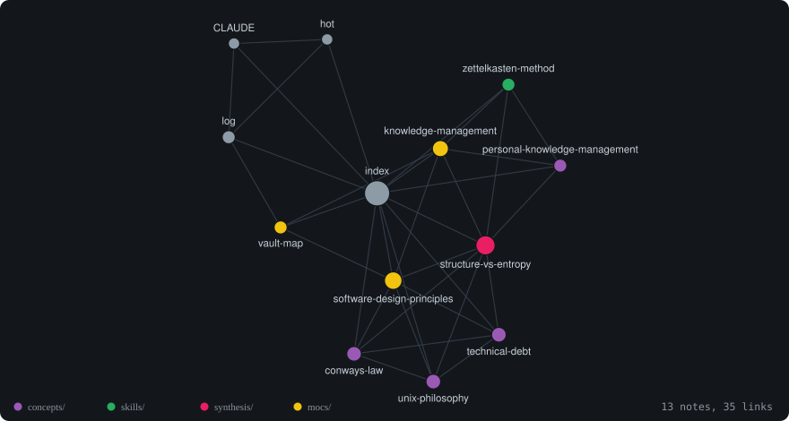
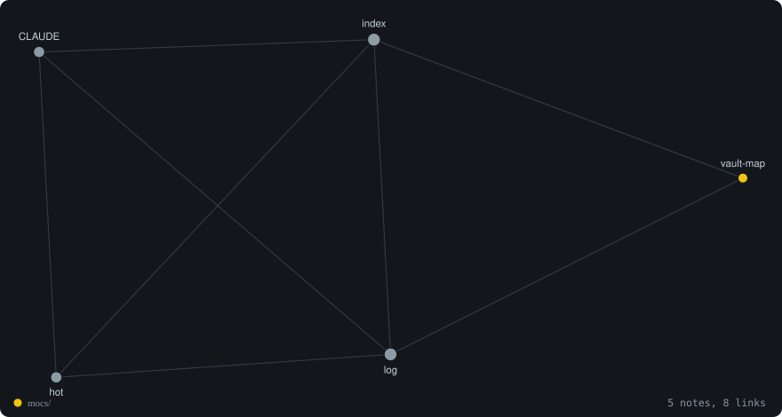
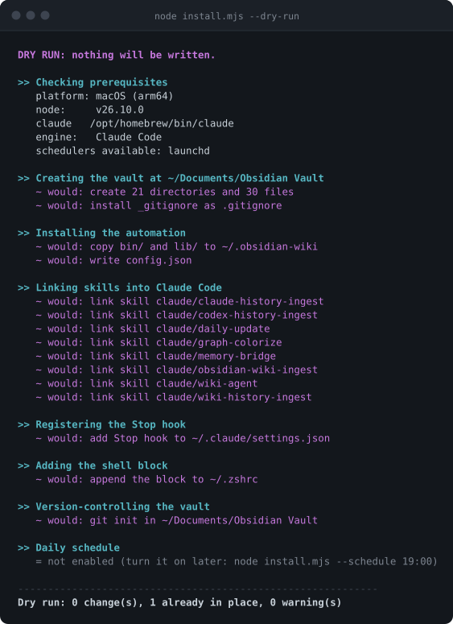

<div align="center">


# Obsidian Vault Kit

**Everything you worked out with Claude Code or Codex, turned into a knowledge graph you
can query.** Point it at a document and it writes linked, filed notes. Use your agent
normally and it mines your own sessions for whatever was worth keeping, on its own,
once a day.

[](https://github.com/mustafa4101996ahmed/obsidian-vault-kit/actions/workflows/ci.yml)
[](LICENSE)


</div>

<p align="center">
  
</p>

<p align="center">
  <em>A real vault after five documents went in. It started with five seed pages and eight links.<br>
  Rendered from the actual files by
  <a href="docs/images/make-graph.mjs"><code>make-graph.mjs</code></a>, not drawn by hand.</em>
</p>

---

> [!IMPORTANT]
> **A run that recorded nothing ingested nothing.** The runner checks whether
> `.manifest.json` moved and treats an untouched ledger as a failure regardless of the exit
> code. A pipeline that reports success while doing no work is the failure that hides
> longest.

## How it works

You drop a document in, or you simply use your agent. Either way the vault fills up.

<table>
<tr>
<td width="50%"></td>
<td width="50%"></td>
</tr>
<tr>
<td align="center"><sub><b>A fresh install.</b> Five seed pages.</sub></td>
<td align="center"><sub><b>Five documents later.</b> Thirteen notes, thirty-five links, four zones.</sub></td>
</tr>
</table>

That second picture came from one command. Five Wikipedia articles went into `_raw/`,
and `/obsidian-wiki-ingest` decided that Conway's Law, technical debt and the Unix
philosophy were `concepts/`, that the Zettelkasten method was a `skills/` page, that two
clusters had formed worth giving hub pages, and that one idea ran through both of them
and deserved a `synthesis/` note. Nobody told it the taxonomy; it read `AGENTS.md` and
applied it.

```
  a document you drop in --+
                           +--> your agent reads it, decides which zone
  your Claude Code or   ---+    each piece belongs in, writes linked notes
  Codex sessions                and records the source in the ledger
                                             |
                                             v
                               a graph you can query, instead of
                               a folder you never open again
```

Nine folders sort notes by **shape**, not subject: `skills/` answers "how do I do this",
`concepts/` answers "why does this behave this way", `projects/` ends and `areas/` doesn't.
One rule carries most of the value. If a note would still be true after the project ended, it
does not belong in the project folder; lessons buried in a project are lost the day you
archive it.

Two connection rules keep the graph alive, and the tooling checks both: every note needs one
link in and one link out. A note nothing points at is a note you will never find again.

### What is verified today

Every row below was executed, not reviewed. CI runs all three suites on all three platforms on
every push.

| Surface | State |
|---|---|
| Install, reinstall, uninstall, and a dry run that writes nothing | Verified on macOS, Linux and Windows |
| Lock, 20-minute watchdog, manifest-stamp check, pending arithmetic | Verified on all three |
| launchd, systemd user timer, cron, Task Scheduler | Each registered and removed on its own platform |
| Skill links: symlink on Unix, junction on Windows | Verified, including reading through the link |
| Desktop notifications | Accepted by the notifier on macOS and Linux. Actual on-screen delivery cannot be confirmed from a script and is not relied on |
| Junctions without administrator rights | Probed in CI with a de-elevated basic-user token |
| The full runner path, agent spawn to drained queue | Verified against a stub agent on all three platforms |
| A clean run that changes nothing is a failure | Verified: the runner exits 1 and keeps the queue |
| Both agents on one machine: one schedule, both histories ingested | Verified through install, config and the runner's arguments |
| Upgrading an existing install: config migrates on read, an edited `CLAUDE.md` becomes `AGENTS.md` with a backup | Verified end to end through the installer |
| Codex's flags, hook format and trust behaviour | Verified against Codex 0.159.0: every documented flag exists, the hook the installer writes is accepted and fires, and trust is genuinely what gates it |
| A full Codex ingest end to end | Not yet. The runner is tested against a stub agent; only the plumbing around the model call is covered |
| The graphs above | Rendered from a real ingest of five public documents |

## Quick start

**You need** Node 22+, Obsidian, and one agent CLI — either
[Claude Code](https://claude.com/claude-code) or [Codex](https://github.com/openai/codex). The
installer detects which you have. If you have both, it wires up both and ingests both histories on
one daily run. Nothing else: the kit itself has no dependencies.

```bash
git clone https://github.com/mustafa4101996ahmed/obsidian-vault-kit ~/obsidian-vault-kit
cd ~/obsidian-vault-kit
node install.mjs --dry-run   # every step it would take, changing nothing
node install.mjs             # then do it
```

Open a new terminal afterwards; the shell block only loads in a fresh one. Windows works the
same way, with `$HOME` in place of `~`.

<p align="center">
  
</p>

```bash
node install.mjs --vault "/somewhere/else"   # put the vault elsewhere
node install.mjs --schedule 19:00            # turn on the daily ingest
node install.mjs --host codex                # wire up one agent, not every one found
node install.mjs --engine claude             # which agent runs the daily ingest
node install.mjs --uninstall                 # remove everything except your notes
```

> [!NOTE]
> The installer never overwrites. Existing files are kept, and each hook file it touches —
> `settings.json` for Claude, `hooks.json` for Codex — plus your shell startup file, is copied to
> a timestamped `.bak-` first. Run it again whenever you like.

## Feeding the vault

```bash
cp ~/Downloads/whatever.pdf ~/Documents/Obsidian\ Vault/_raw/
cd ~/Documents/Obsidian\ Vault && claude   # or: codex
#   /obsidian-wiki-ingest    then point it at the file
```

Running your agent from inside the vault matters: that is how it picks up `AGENTS.md` and the
rules it must follow when writing.

```bash
wiki-history           # ingest session history, if any is pending
wiki-history --force   # ingest regardless
wiki-log               # what the last run did
```

A scheduled run does the same work daily, catches up if the machine was asleep, and costs
nothing on days when nothing is pending. **A failed run never reports success.** The manifest
check above means a run that changed no ledger row is recorded as a failure, so the log tells
you the truth rather than serving a quiet no-op as a win.

## Scheduling

One interface, four backends. The installer picks the best available and says which.

| Platform | Backend | Catches up after sleep | Needs admin |
|---|---|---|---|
| macOS | launchd user agent | yes | no |
| Linux | systemd user timer, `Persistent=true` | yes | no |
| Linux | cron, when systemd is unusable | no | no |
| Windows | Task Scheduler | yes | no |

If systemd is detected but refuses the unit, the kit removes the files it wrote and falls
through to cron rather than leaving orphaned units and no schedule. Where no scheduler exists
at all, the install still succeeds and tells you to run `wiki-history` yourself.

## The eight skills

Run these inside an agent session, from the vault folder.

| Command | What it does |
|---|---|
| `/obsidian-wiki-ingest` | Turn a document into linked, filed notes |
| `/claude-history-ingest` | Mine Claude Code sessions and memory files |
| `/codex-history-ingest` | Mine Codex CLI sessions from `~/.codex/sessions/` |
| `/wiki-history-ingest claude\|codex` | The same in bulk, for everything new since last time |
| `/wiki-agent` | Ask a question of your history, then ingest just the answer |
| `/daily-update` | Rebuild the index, refresh `hot.md`, check graph health |
| `/memory-bridge` | Compare what different AI tools contributed |
| `/graph-colorize` | Extend the graph colours to your own tags |

Skills live in `.agents/skills/` inside the vault, with links from `~/.claude/skills/` and
`~/.codex/skills/` pointing at them, one set per host you have. Edit the copy in the vault,
so your changes are version-controlled alongside your notes.

## Tests

CI runs four suites; a branch that only passes the first can still fail CI.

```bash
node test/suite.mjs          # 71 checks: install, uninstall, dry run, scheduler, shell block
node test/host.mjs           # 66 checks: host registry, invocation arguments, event condensing, log pruning
node test/codex.mjs          # 102 checks: config migration, per-host hooks and skill links, install per host
node test/runner.mjs         # 42 checks: the runner end to end against stub agents -- slow, ~2 minutes (the watchdog)
node test/suite.mjs --keep   # leave the throwaway home behind to inspect
```

The suite drives the real installer and the real runner as child processes against a
throwaway home, so it never reads or writes anything of yours. Platform-specific assertions
are skipped rather than silently passed, and the summary prints the skip count, so a green run
on one OS is never mistaken for a green run everywhere.

Several of this project's bugs were only findable by running the code somewhere else. Log
filenames used UTC, so east of Greenwich `wiki-log` reported no log for a day that had one.
The shell block was written to `.zshrc` on a Linux box with no zsh installed. systemd unit
files ignored `XDG_CONFIG_HOME` and landed where systemd was not looking. When Codex support
landed, the installer linked no skills at all on a machine with neither agent installed — and
every local run passed, because the machine it was written on had both. Then installing Codex
locally broke four tests that had quietly depended on it being absent. And the ingest turned out
to re-queue itself under Codex, because the trick that stops that under Claude is a flag Codex
has no equivalent of. None of them is visible by reading.

## Repository map

```
install.mjs            one installer, all platforms. --dry-run and --uninstall
lib/host.mjs           Claude Code | Codex, behind one interface
lib/platform.mjs       paths, OS detection, capability probes
lib/schedule.mjs       launchd | systemd | cron | schtasks, behind one interface
lib/vault.mjs          scaffold copy, manifest stamping, skill links, contract migration
lib/hooks.mjs          Stop-hook merge into either host's config, backed up and de-duplicated
lib/prompt.mjs         what the daily run asks for, one pass per history source
lib/output.mjs         condensing an event stream for a person, and bounding the logs
lib/shell.mjs          the marked block added to your shell startup file
lib/notify.mjs         osascript | notify-send | toast | silent
bin/run-ingest.mjs     the daily runner. Almost entirely guards
bin/mark-pending.mjs   Stop-hook target, shared by both hosts. Must never throw
test/harness.mjs       assertions and the throwaway-home discipline the suites share
test/suite.mjs         install, uninstall, schedule, shell block
test/host.mjs          the host registry, event condensing, log pruning. All in process
test/codex.mjs         config migration, per-host hooks and links, install per host
test/runner.mjs        the runner end to end for both hosts, incl. the stall watchdog. Slow
vault-scaffold/        becomes your vault. Ships with no notes
```

Only `lib/platform.mjs` and `lib/schedule.mjs` know which operating system they are on, and
only `lib/host.mjs` knows which agent CLI it is talking to. If adding a platform means editing
a third file, or adding an agent means editing a second one, the abstraction has leaked.

## Documentation

| File | What is in it |
|---|---|
| [`SETUP-GUIDE.md`](SETUP-GUIDE.md) | Install to first ingest, per platform, with a troubleshooting table |
| [`docs/ARCHITECTURE.md`](docs/ARCHITECTURE.md) | The five layers, why each guard exists, failure modes ranked by how long they hide |
| [`vault-scaffold/AGENTS.md`](vault-scaffold/AGENTS.md) | The contract every agent follows: zones, frontmatter, graph rules, ingest ground rules (`CLAUDE.md` points to it, for Claude Code) |
| [`vault-scaffold/mocs/vault-map.md`](vault-scaffold/mocs/vault-map.md) | What belongs in which folder, and how to decide |

## Licence

[MIT](LICENSE). Use it, fork it, ship it.
